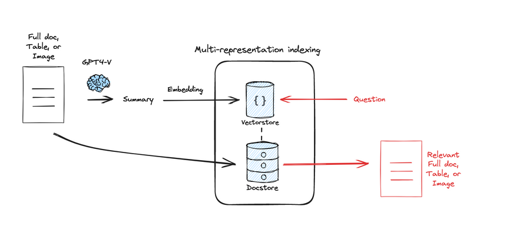
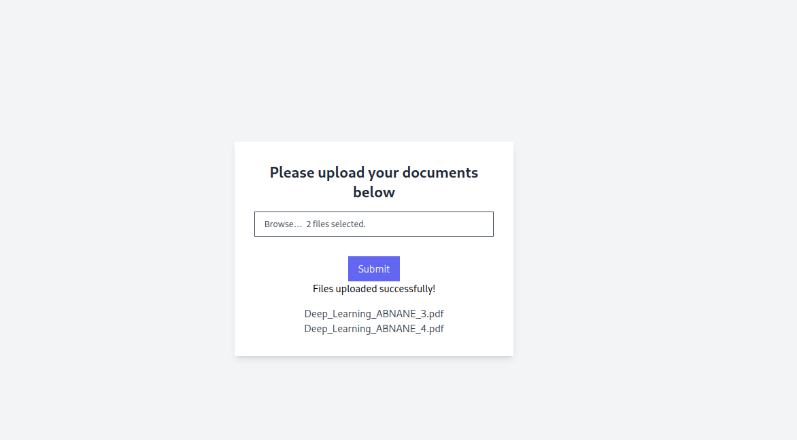
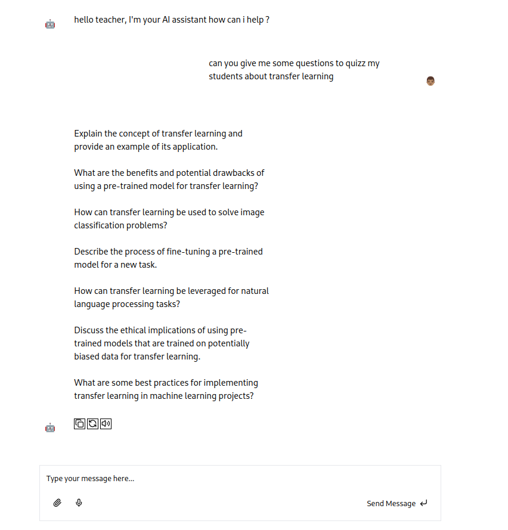
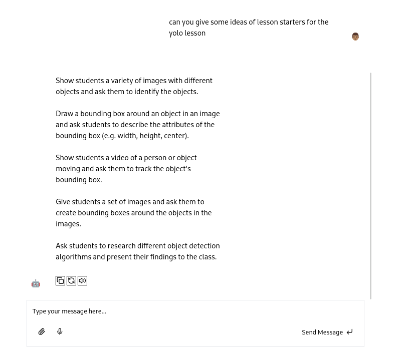

# AI Teaching Assistant

The **AI Teaching Assistant** is a tool designed to assist educators in managing and enhancing their course materials. It offers intelligent suggestions for quiz questions, session starters, and other teaching aids based on the instructor's prompts. By leveraging language models, the assistant tailors its suggestions to match the subject and style of the provided material.

## Features

- **Course Material Upload**: Teachers can upload course documents, which the assistant uses to understand the material and generate relevant suggestions.
- **Intelligent Suggestions**: Based on user prompts, the assistant generates suggestions for:
  - Quiz questions
  - Session starters
  - Discussion topics
  - Summary content
- **Customizable Prompts**: Instructors can provide specific prompts to get more tailored responses.
- **User-Friendly Interface**: A React-based front end provides a simple and intuitive interface for interacting with the assistant.

## Architecture Overview

This project is built using the following technologies:

- **FastAPI**: Backend framework for handling API requests and managing interactions with the AI model.
- **LangChain**: Framework used for orchestrating the language model's responses, ensuring context is effectively managed throughout interactions.
- **React**: Front-end framework for building a responsive and interactive UI.
- **AI Model**: The assistant uses a language model (Gemini) for generating suggestions based on the uploaded materials and prompts.

## Indexing

The image above provides a visual overview of the indexing process, from parsing to storage in the vector database.

## Results

### Uploading files

### prompt answers

